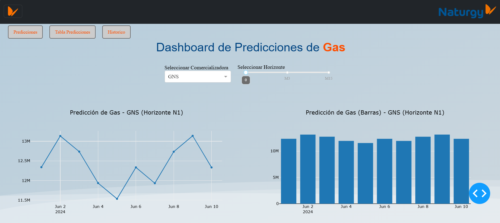
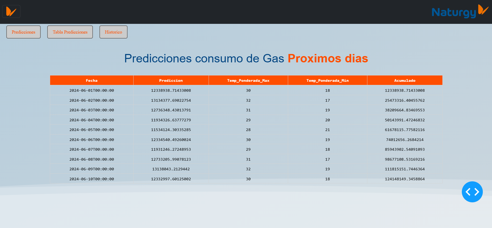
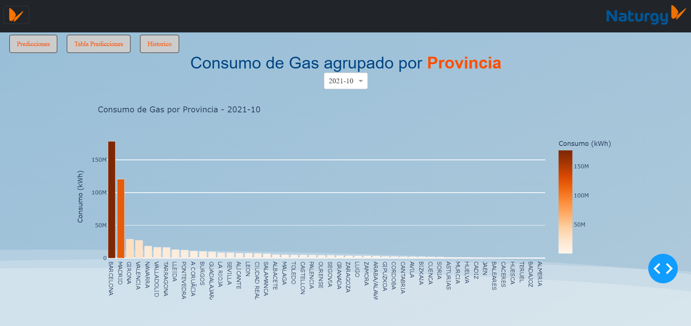
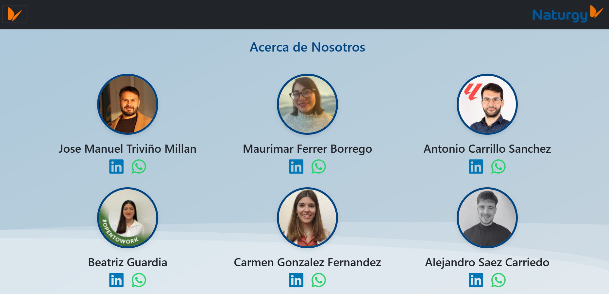

# Proyecto de Predicción de Demanda de Gas:

Este proyecto tiene como objetivo desarrollar un modelo de predicción de la demanda de Gas para diferentes comercializadoras. Utilizamos enfoques bayesianos y modelos ARIMA para mejorar la precisión de nuestras predicciones, integrando datos históricos de temperaturas y otras variables relevantes.

Hemos decicido crear un panel para Analizar y visualizar los datos y predicciones. Nuestro panel esta creado con python y Dash,  permite seleccionar predicciones para la diferentes comercializadoras y sus diferentes targets, como tabien visualizar datos historicos de los consumos de Gas en las diferentes Provincias de España.

## Estructura del Proyecto:

**app.py**: Procesa los archivos .xlxs que contienen las predicciones de los Modelos Bayesianos combinados con el Modelo ARIMA

**run.py**: Este es el script principal de la aplicación. Utiliza Dash para crear un panel web interactivo donde los usuarios pueden seleccionar las diferentes comercializadoras y targets, selccionar los datos historicos por Año-Mes.

 **styles.css**: Esta hoja de estilo define el estilo visual del panel, incluido el diseño, las fuentes y los colores.

 **index.html**: Levanta un entorno Web que alberga todo el proyecto.

  **nosotos.html**: Contiene informacion acerca de los integrantes del proyecto.

  **data**: Contien los archivos originales, los archivos ajustados y corregidos como tambien las Precciones.

  **Notebooks**: Contiene los Scripts que procesan los datos de los diferentes datasets como tambien el scripts ontiene el código para entrenar los modelos bayesianos y ARIMA, ajustando las predicciones de demanda de gas con base en los datos históricos.

## Instrucciones de Configuración

### 1.Clonar el Repositorio

Clona este repositorio en tu máquina local:

```bash
git clone https://github.com/josetrivino89/PrediccionesGas.git
```

### 2. Instalar Dependencias

Navega al directorio del proyecto e instala las librerías necesarias:

```bash
pip install -r requirements.txt
```
(Nota: Asegúrate de haber creado un requirements.txt con las dependencias necesarias, o puedes instalar manualmente los paquetes utilizados en los scripts, como pandas, dash, plotly, numpy, pymc3, y statsmodels.)

### 3. Ejecutar el Panel

Finalmente, ejecutar el script app.py para lanzar el panel interactivo:

```bash
python NaturgyProject\app\run.py
```

esto levanta un puerto`http://127.0.0.1:8050/dash` para ejecurtar nuestro panel

### 4. Ejecutar Live Server:

Una vez finalmente ejecutada nuesta aplicacion, debemos asegurarnos de tener instalado nuesto Live Server para levantar un entorno web y visualizar nusetro proyecto.










### 5. Personalizar el Estilo

Si deseas personalizar la apariencia del panel, puedes modificar el archivo style.css

